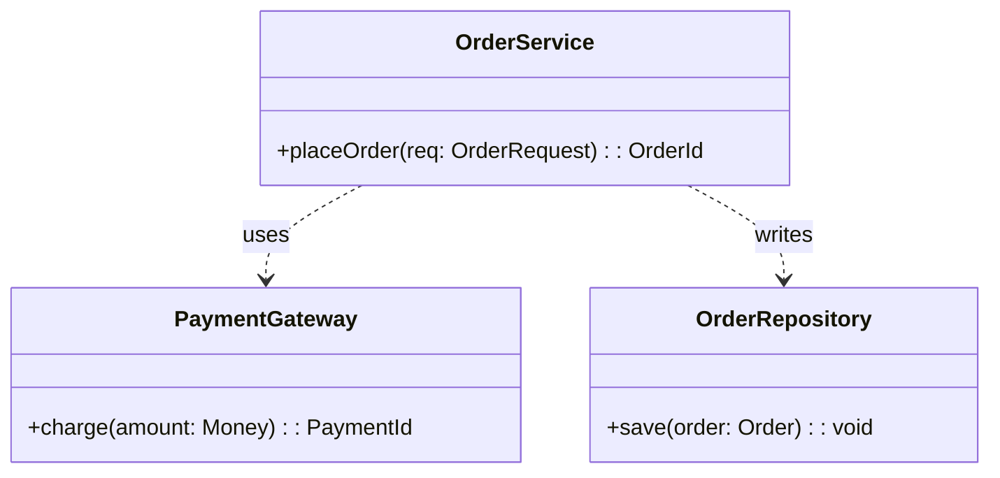
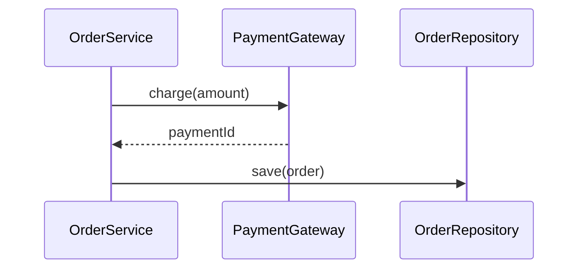
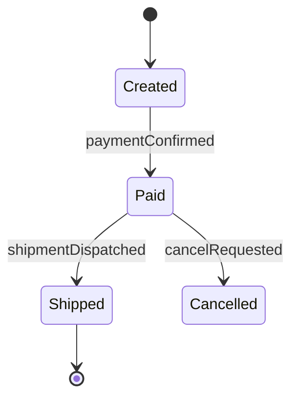
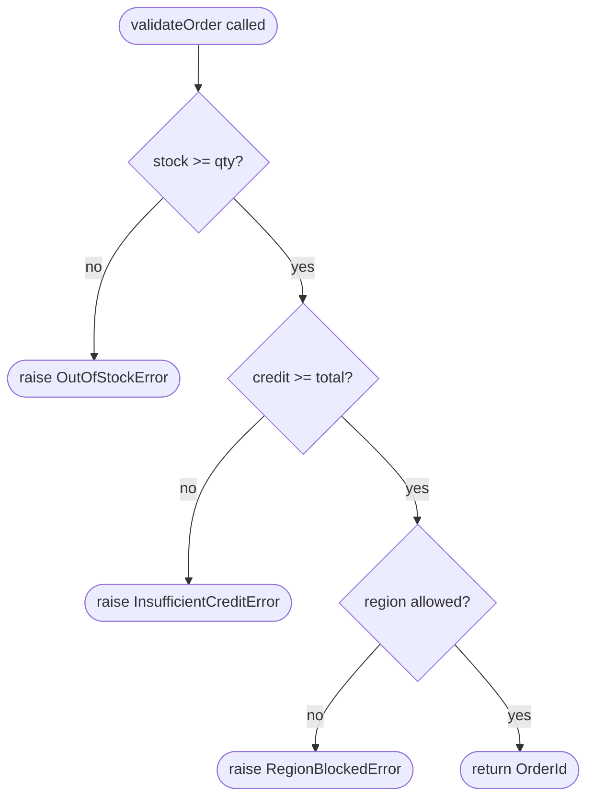

# Feature Detailed Design：[Feature Title]（Feature #ID）

**Date**: YYYY-MM-DD
**Feature**: #ID — [title]
**Priority**: high/medium/low
**Dependencies**: [list or "none"]
**Design Reference**: docs/plans/YYYY-MM-DD-<topic>-design.md § 2.N
**SRS Reference**: FR-xxx

## Context

[1-2 句话：本特性做什么、为何重要]

## Design Alignment

[将设计文档 §2.N 的**完整**内容复制于此 — Overview、Key Types、Integration Surface。]

- **Key types**: [自 §2.N.2 — 本特性引入或扩展的关键类/模块]
- **Provides / Requires**: [自 §2.N.3 Integration Surface — Contract IDs + Provider/Consumer]
- **Deviations**: [无 / 说明偏离及经用户审批记录]

**UML 嵌入**（按 feature-design-execution §2a 触发判据；不满足则跳过本块）：
- ≥2 类/模块协作（含新增/修改） → 嵌入 `classDiagram`（允许 `classDef NEW|MODIFIED|EXISTING` 色标，系统设计惯例对齐）
- ≥2 对象/服务的调用顺序 → 嵌入 `sequenceDiagram`（无装饰）
- 节点/参与者/消息均用**真实标识符**（ClassName、methodName），禁 A/B/C 代称
- 若图内容已在系统设计 §4.N 等价表达 → 写一行 `"见系统设计 §4.N 类图"`，不重复画

## SRS Requirement

[将 SRS 中的**完整** FR-xxx 章节复制 — 含 EARS 陈述、验收准则、Given/When/Then 场景]

## Interface Contract

| Method | Signature | Preconditions | Postconditions | Raises |
|--------|-----------|---------------|----------------|--------|
| `method_name` | `method_name(param: Type, ...) -> ReturnType` | [调用前必须成立的条件] | [调用后被保证的条件] | [异常 + 条件] |

**方法状态依赖**（某方法行为依赖显式状态、状态数 ≥2 有 transition）：在对应方法行下方嵌入 `stateDiagram-v2`。真实状态名 / 真实事件名；**禁**任何色彩、图标、`rect`、皮肤主题、`<<stereotype>>` 装饰。无状态依赖 → 跳过本块。

**Design rationale**（每条非显见决策一行）：
- [如：为何阈值默认为 0.6、为何参数 X 可选]
- **跨特性契约对齐**：若本特性在 Design §4 中作为 Provider 或 Consumer 出现，对应方法签名必须匹配 §4 schema。标注 Contract ID（如 IAPI-001）以便追溯。

## Visual Rendering Contract（仅 ui: true）

> N/A — [原因，例如"后端专用特性，无视觉输出"]

| Visual Element | DOM/Canvas Selector | Rendered When | Visual State Variants | Minimum Dimensions | Data Source |
|----------------|---------------------|---------------|----------------------|-------------------|-------------|
| [例如：贪吃蛇身段] | `canvas#game-board` 或 `div.snake-segment` | [game tick / 页面加载] | [alive=green, dead=red, paused=grey] | [每格 20x20px] | [GameState.segments[]] |

**Rendering technology**: [Canvas 2D / WebGL / DOM elements / SVG / CSS animation]
**Entry point function**: [如 `GameRenderer.draw()`，由 `gameLoop()` 调用]
**Render trigger**: [如 requestAnimationFrame 循环 / 事件驱动 / 响应式状态]

**正向渲染断言**（触发后必须视觉可见）：
- [ ] [元素 1 被绘制 / 可见且尺寸 > 0]
- [ ] [元素 2 显示来自 state 的数据]
- [ ] [容器非空 / canvas 含非透明像素]

**交互深度断言**（已渲染元素**必须**响应其设计意图的交互 — 只渲染而无交互属于 "display-only" 缺陷）：
- [ ] [元素 1 响应 [按键 / 点击 / 拖拽] → 视觉输出随之变化]
- [ ] [元素 2 在 [状态变化 / 用户输入] 时更新 → 展示数据刷新]

## Implementation Summary

[3-5 段散文。每段分别涉及：主要类 / 函数；它们之间的调用链；关键设计决策或非显见约束；遗留 / 存量代码交互点；与 §4 契约的集成。]

**方法内决策分支**（任一方法的关键设计决策涉及 ≥3 决策分支或异常路径）：在本段下方嵌入 `flowchart TD` 替代散文说明。真实方法名、真实条件文本；**禁**任何装饰（色彩 / 图标 / `rect` / 皮肤）。散文仅保留图外注解。无复杂分支 → 跳过本块。

### Boundary Conditions

| Parameter | Min | Max | Empty/Null | At boundary |
|-----------|-----|-----|------------|-------------|
| [param]   | [val] | [val] | [behavior] | [behavior] |

> 任何带有数值范围、大小或可空输入参数的方法都要求填写此表。TDD Rule 4 依此表系统地识别可能的错误实现。无非平凡参数的特性可写 "N/A — no boundary conditions"。

### Existing Code Reuse

[由 Feature Design SKILL Step 1c（Existing Code Reuse Check）填充。列出本特性复用而非重实现的已有符号 / 文件。若无复用，写 "N/A — greenfield feature" 或 "N/A — searched keywords: <terms>, no reusable match"。]

| Existing Symbol | Location (file:line) | Reused Because |
|-----------------|---------------------|----------------|
| `UserRepository.findByEmail` | `src/repos/UserRepository.java:L42` | 既有查询已满足本特性的查找需求 |

## Test Inventory

| ID | Category | Traces To | Input / Setup | Expected | Kills Which Bug? |
|----|----------|-----------|---------------|----------|-----------------|
| A  | FUNC/happy | FR-xxx AC-1 | [具体值] | [精确结果] | [可捕获的错误实现] |
| B  | FUNC/error | §Interface Contract Raises | [触发条件] | [异常类型 + 消息] | [遗漏的分支] |
| C  | BNDRY/edge | §Implementation Summary Boundary Conditions | [边界值] | [精确行为] | [off-by-one 或缺失 guard] |
| D  | INTG/db    | §Interface Contract + required_configs | [真实 DB setup] | [数据已持久化且可查询] | [连接未建立 / 错表] |
| E  | INTG/api   | §2.N 跨服务调用 | [真实 HTTP 端点] | [正确响应 schema] | [错误端点 / 未处理 timeout] |
| F  | UI/render  | §Visual Rendering Contract | [页面加载、游戏开始] | [canvas 含非透明像素 / DOM 元素可见且尺寸 > 0] | [render 函数未被调用 / canvas 空白 / DOM 元素未追加] |

Category 格式：`MAIN/subtag`，MAIN 为 `FUNC, BNDRY, SEC, UI, PERF, INTG` 之一，subtag 为自由标签。

若本特性无外部依赖（纯计算、无 IO、无 DB、无网络），显式注明：
> INTG: N/A — pure function, no external I/O

## Verification Checklist
- [ ] 所有 SRS 验收准则（来自 srs_trace）已追溯到 Interface Contract 的 postconditions
- [ ] 所有 SRS 验收准则（来自 srs_trace）已追溯到 Test Inventory 行
- [ ] Boundary Conditions 表覆盖所有非平凡参数（或声明 "N/A — no boundary conditions"）
- [ ] Interface Contract Raises 列覆盖所有预期错误条件
- [ ] Test Inventory 负向占比 >= 40%
- [ ] ui:true 特性的 Visual Rendering Contract 完整（列出全部视觉元素、定义正向渲染断言）
- [ ] 每个 Visual Rendering Contract 元素至少对应 1 行 UI/render Test Inventory
- [ ] Existing Code Reuse 章节已填充（或声明 "N/A — greenfield feature"）
- [ ] UML 图（若存在）节点 / 参与者 / 状态 / 消息均使用真实标识符，无 A/B/C 代称
- [ ] 非类图（`sequenceDiagram` / `stateDiagram-v2` / `flowchart TD`）不含色彩 / 图标 / `rect` / 皮肤等装饰元素
- [ ] 每个图元素（类节点、sequence 消息、state transition、flow 决策分支 / 错误终点）在 Test Inventory "Traces To" 列被至少一行引用
- [ ] 每个被跳过的章节都写明 "N/A — [reason]"

## Clarification Addendum

> 无需澄清 — 全部规格明确。

| # | Category | Original Ambiguity | Resolution | Authority |
|---|----------|--------------------|------------|-----------|
| — | — | — | — | user-approved / assumed |

<!-- This section is populated by the SubAgent when:
     1. Low-impact ambiguities are assumed (Authority = "assumed")
     2. User-approved resolutions are provided via re-dispatch (Authority = "user-approved")
     Feature-ST reads this section to avoid re-asking resolved questions. -->
